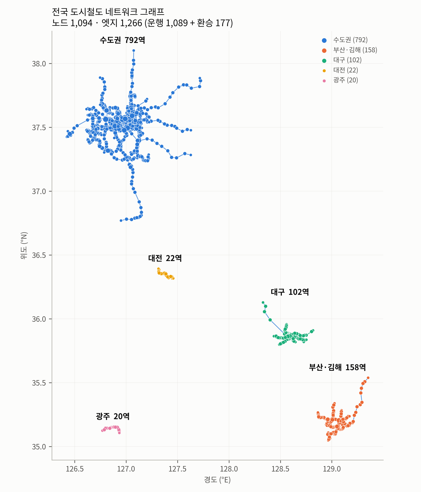
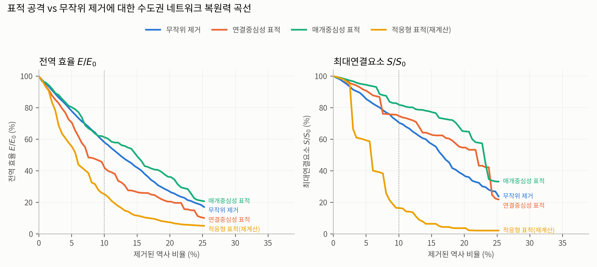
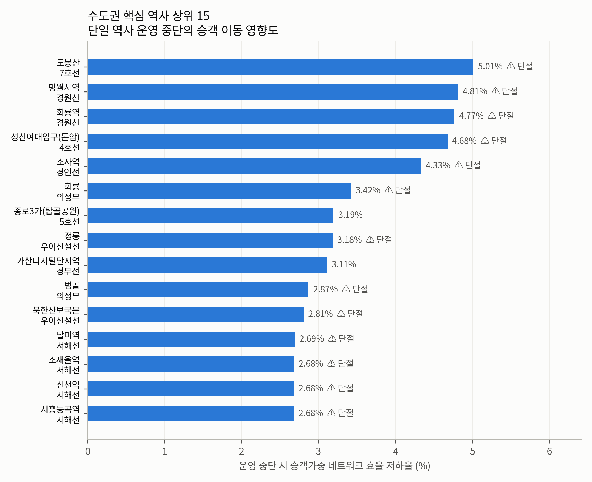
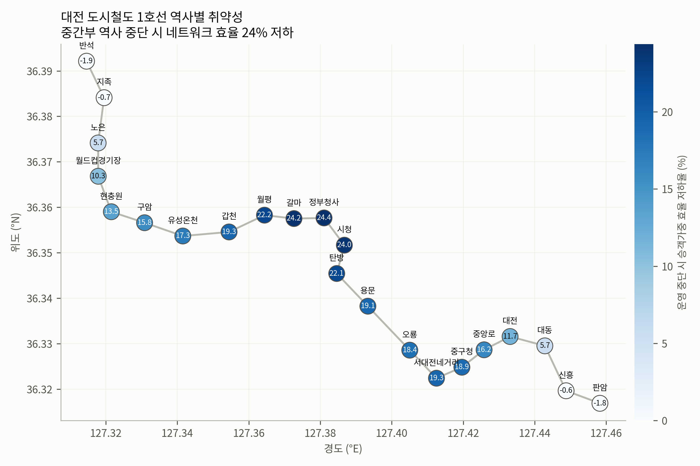
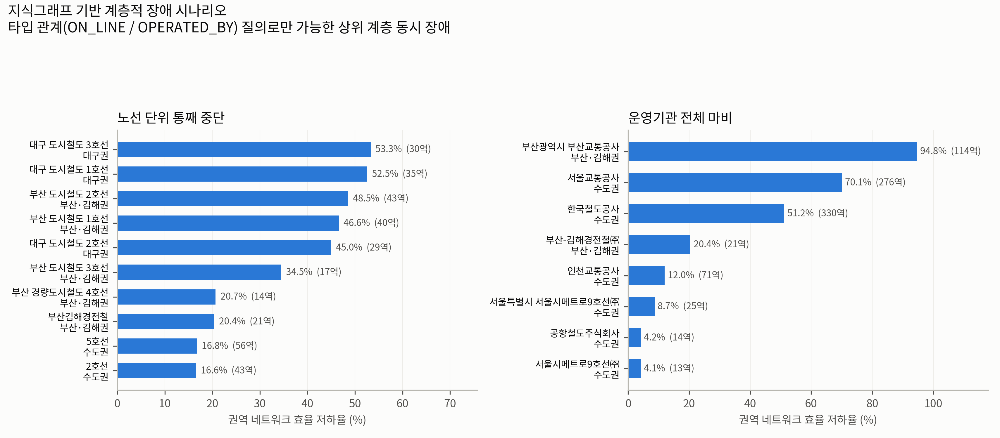
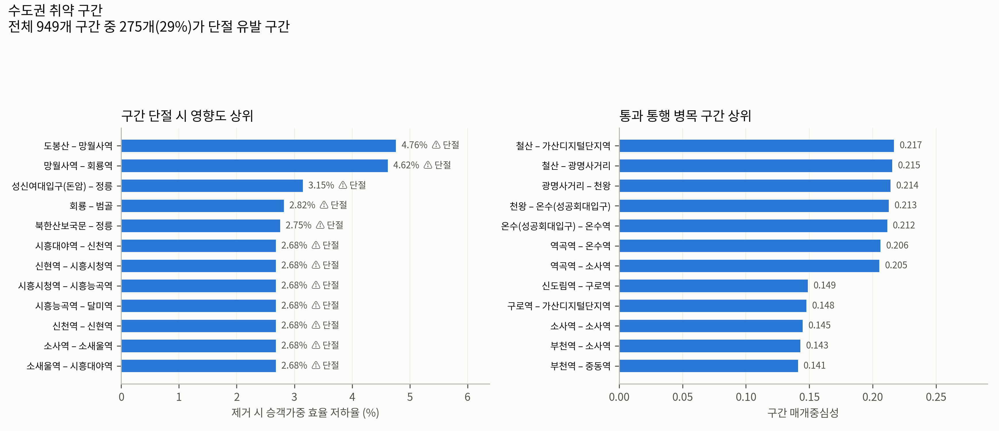

# 도시철도 네트워크 취약성 분석 (Raility)

국가철도공단 표준데이터로 **전국 도시철도망을 그래프·지식그래프로 구축**하고, 특정
역사·환승역의 운영 중단이 네트워크 구조와 승객 이동에 미치는 영향을 정량화하여
**핵심 역사와 취약 구간**을 도출한다.

- **투고 대상**: 한국ITS학회논문지(KITS)
- **분석 규모**: 물리 그래프 노드 1,094 · 엣지 1,266 / 지식그래프 노드 1,177 · 관계 5,688
- **데이터 기준일**: 역사·노선 2026-06-30, 운행 2026-02-28

---

## 핵심 결과

**1. 수도권 도시철도망은 표적 공격에 매우 취약하다.**
역사의 10%만 선택적으로 마비되면 네트워크 전역 효율은 **12.6%** 수준으로 붕괴한다.
동일 규모 무작위 고장(52.4%) 대비 **약 4.2배** 취약하며, 최대연결요소는 5.9%까지 파편화된다.

| 제거 전략 | 10% 제거 시 전역 효율 | 최대연결요소 |
|---|---|---|
| 무작위 고장 | 52.4% | 65.0% |
| 매개중심성 표적 | 39.0% | 54.9% |
| 연결중심성 표적 | 13.6% | 11.8% |
| **적응형 표적(재계산)** | **12.6%** | **5.9%** |

**2. 환승역 상위 10개 마비 시 효율 24.5% 저하.** 상위 30개로 확대하면 40.2% 저하한다.

**3. 수도권 791개 역 중 264개(33.4%)가 단절 유발 역사**다. 단일 역사 중단만으로 네트워크가
분리되는 구조적 단절점이 전체의 3분의 1에 달한다.

**4. 승객가중 영향도 상위 역사** (운행빈도 가중 효율 저하율)

| 순위 | 역사 | 노선 | 효율 저하 | 단절 |
|---|---|---|---|---|
| 1 | 도봉산 | 7호선 | 5.01% | ● |
| 2 | 망월사역 | 경원선 | 4.81% | ● |
| 3 | 회룡역 | 경원선 | 4.77% | ● |
| 4 | 성신여대입구(돈암) | 4호선 | 4.68% | ● |
| 5 | 소사역 | 경인선 | 4.33% | ● |

매개중심성 최상위(가산디지털단지 0.272, 소사 0.237)와 **실제 제거 영향도 순위가 일치하지
않는다** — 중심성 지표만으로 핵심 역사를 판단하면 실제 취약점을 놓친다는 점이 본 연구의
주요 발견이다.

**5. 취약 구간(선로 구간) — 949개 중 275개(29%)가 단절 유발 구간.**
역이 아니라 **선로 구간**이 끊기는 상황(사고·공사)을 별도로 전수 분석했다.
영향도 최상위는 도봉산–망월사(4.76%)·망월사–회룡(4.62%)으로, 경원선 북부의 단일 경로 구간이
끊기면 의정부 이북이 통째로 분리된다. 통과 통행이 몰리는 병목 구간은 철산–가산디지털단지
(구간 매개중심성 0.217) 등 **7호선 광명 구간**에 집중된다.

**6. 지식그래프 기반 계층적 장애 시나리오.** 역이 어느 노선·기관·지역에 속하는지를 타입
관계로 표현하면, 단일 그래프로는 표현조차 불가능한 **상위 계층 동시 장애**를 시뮬레이션할
수 있다.

| 단위 | 최대 영향 대상 | 제거 역수 | 권역 효율 저하 |
|---|---|---|---|
| 노선 | 대구 도시철도 3호선 | 30 (31.9%) | **70.8%** |
| 노선 | 2호선 (수도권) | 43 (5.2%) | 22.6% |
| 운영기관 | 부산교통공사 | 114 (84.4%) | **93.7%** |
| 운영기관 | 서울교통공사 | 276 (33.5%) | 85.2% |
| 운영기관 | 한국철도공사 | 330 (40.1%) | 59.6% |
| 광역시도 | 대구광역시 | 89 (94.7%) | 99.5% |

역당 파급력(효율 저하 ÷ 제거 역수)으로 보면 **대구 3호선이 2.36으로 최고**, 수도권에서는
2호선이 0.53으로 가장 높다.

**7. 대전 사례**: 1호선 단일 노선 구조로, 중간부 역사(정부청사 31.6%, 갈마 31.4%,
시청 31.2%) 중단 시 네트워크 효율이 약 31% 저하된다. 종단부(반석 3.0%, 판암 3.1%)와
**10배 이상 차이**가 난다.

### 권역별 네트워크 특성

| 권역 | 역수 | 엣지수 | 평균 차수 | 평균 최단거리 |
|---|---|---|---|---|
| 수도권 | 791 | 949 | 2.40 | 39.0 km |
| 부산·김해 | 158 | 170 | 2.15 | 19.8 km |
| 대구 | 102 | 107 | 2.10 | 15.6 km |
| 대전 | 22 | 21 | 1.91 | 7.1 km |
| 광주 | 20 | 19 | 1.90 | 6.7 km |

---

## 그림

| | |
|---|---|
|  |  |
| **그림 1.** 전국 도시철도 네트워크 그래프 | **그림 2.** 복원력 곡선 |
|  |  |
| **그림 3.** 핵심 역사 상위 15 | **그림 4.** 대전 사례 |


**그림 5.** 지식그래프 기반 계층적 장애 시나리오


**그림 6.** 취약 구간 — 구간 단절 영향도 및 통과 통행 병목

---

## 방법

### 그래프 구축
- **노드** = 역사. 전역 고유키 `노선번호|역번호`
- **운행 엣지** = 노선정보 `정거장구성`의 연속 역쌍 (+ 운행정보로 신설·지선 구간 보완)
- **환승 엣지** = 동일 역명 · 좌표근접(<1.2 km) · 다른 노선
- **가중치** = 실측 역간거리(54.2% 커버) → 미확보 구간은 좌표 기반 직선거리, 환승 200 m 환산

### 지식그래프
`Station`·`Line`·`Operator`·`Region`·`MetroArea` 5종 엔티티와 `CONNECTS_TO`·`TRANSFERS_TO`·
`ON_LINE`·`OPERATED_BY`·`LOCATED_IN`·`IN_METRO_AREA`·`LINE_OPERATED_BY` 7종 관계.
중심성·제거 영향도가 역 속성으로 병합되어 KG 자체가 진단 결과를 담는다.
스키마·질의 예시는 [`docs/ONTOLOGY.md`](docs/ONTOLOGY.md) 참조. RDF Turtle과 Neo4j Cypher로도
제공한다.

**지식그래프 보는 법** — 목적에 따라 셋 중 하나를 쓰면 된다.

| 방법 | 준비 | 쓸모 |
|---|---|---|
| **`kg_explorer.html`** | 없음. 파일을 브라우저로 열면 끝 | 역 클릭 → 그 역의 KG 관계·취약성 확인. 발표·시연용 |
| **Neo4j** | Neo4j Desktop 설치 후 `kg/kg_import.cypher` 실행 | Cypher 질의로 임의 패턴 탐색 |
| **Gephi** | Gephi 설치 후 `kg/knowledge_graph.graphml` 열기 | 레이아웃·군집 시각화 |

`kg_explorer.html`은 `python make_explorer.py`로 언제든 다시 만들 수 있다(데이터가 파일 안에
그대로 들어가므로 인터넷·서버 없이 동작).

### 분석
1. **중심성**: 연결·매개·근접·고유벡터 (거리 가중)
2. **단일 역사 제거 전수 스윕**: 791개 역을 하나씩 제거하며 전역 효율·최대연결요소 변화 실측
2-b. **구간(엣지) 제거 전수 스윕**: 949개 구간을 하나씩 끊어 취약 구간 도출 + 구간 매개중심성
3. **순차 제거 시뮬레이션**: 무작위(10회 평균) vs 연결중심성 / 매개중심성 / 적응형(매 단계 재계산) 표적
4. **계층적 장애 시나리오**: KG 타입 관계를 질의해 노선·운영기관·광역시도 단위 동시 중단
5. **승객 이동 영향**: OD 데이터 부재를 **운행빈도 가중**으로 대체.
   구간별 평일 열차 편수(커버리지 91.2%)를 노드 강도로 환산해 중력모형형 가중 효율
   `E_p = Σ w_i w_j / d_ij` 산출

> **효율 정규화 규약**: 제거 분석의 전역 효율은 **원 네트워크 크기로 정규화**하여, 제거된
> 역은 도달 불가로 0을 기여하게 했다. 남은 노드로 재정규화하면 종단부 역을 제거할 때
> 평균 거리가 짧아져 효율이 '증가'하는 artifact가 발생한다.

> **OD 대체 근거**: 국가철도공단 명의의 도시철도 OD 데이터가 공개되지 않아, 운행정보
> 표준데이터(223,425행 시각표)에서 산출한 구간별 운행빈도를 승객 이동량 프록시로 사용했다.

---

## 재현 방법

> 실행 전, 용량 문제로 제외된 운행정보 원본 1개를
> [`data/raw/README.md`](data/raw/README.md) 안내대로 내려받아 `data/raw/`에 넣는다.

```bash
pip install -r requirements.txt

python build_graph.py    # 원본 → 물리 그래프 (data/processed/)
python analyze.py        # 중심성·역/구간 제거 시뮬레이션 (results/)
python build_kg.py       # 지식그래프 구축 (kg/)
python kg_scenarios.py   # 계층적 장애 시나리오 (results/)
python visualize.py      # 그림 6종 (figures/)
python make_explorer.py  # 지식그래프 탐색기 HTML
```

### 가상환경 (권장)

**conda (Anaconda 사용 시)**

```bash
conda env create -f environment.yml
conda activate raility
python -m ipykernel install --user --name raility --display-name "Python 3 (raility)"
jupyter lab
```

**venv (표준 파이썬)**

```bash
python -m venv .venv
.venv\Scripts\activate        # Windows  (macOS/Linux: source .venv/bin/activate)
pip install -r requirements.txt
pip install jupyterlab ipykernel
python -m ipykernel install --user --name raility --display-name "Python 3 (raility)"
jupyter lab
```

### 주피터 노트북

스크립트 대신 셀 단위로 중간 결과를 보며 실행하려면 `notebooks/`를 쓴다.
노트북은 위 모듈의 함수를 그대로 호출하므로 코드가 두 벌로 갈라지지 않는다.

| 노트북 | 내용 |
|---|---|
| `01_데이터_그래프구축.ipynb` | 원본 훑어보기, 품질 이슈 확인, 그래프 구축 |
| `02_취약성분석.ipynb` | 중심성, 역·구간 전수 스윕, 복원력 곡선 |
| `03_지식그래프.ipynb` | KG 구축, KG 질의 예시, 계층적 장애 시나리오 |
| `04_시각화.ipynb` | 그림 6종 인라인 표시, 탐색기 생성 |

> 노트북은 저장소 루트 기준으로 동작한다(첫 셀이 `notebooks/`에서 열렸을 때 자동으로
> 상위로 이동). 한글 그림 폰트는 Windows `Malgun Gothic`, macOS `AppleGothic`을 자동 선택한다.

## 저장소 구조

```
├── build_graph.py            물리 그래프 구축 (원본 → nodes/edges/graphml)
├── analyze.py                중심성·제거 시뮬레이션·복원력 곡선
├── build_kg.py               지식그래프 구축 (CSV/GraphML/Turtle/Cypher)
├── kg_scenarios.py           KG 기반 계층적 장애 시나리오
├── visualize.py              그림 6종 생성
├── make_explorer.py          지식그래프 탐색기 HTML 생성
├── make_notebooks.py         notebooks/ 생성
├── environment.yml           conda 가상환경 정의
├── notebooks/                주피터 노트북 4종
├── data/
│   ├── raw/                  국가철도공단 표준데이터 + 역간거리 4종
│   └── processed/            nodes.csv, edges_*.csv, network.graphml
├── kg/                       지식그래프 산출물
├── results/                  중심성·영향도·복원력·시나리오 CSV
├── figures/                  그림 6종 (300 dpi)
└── docs/
    ├── README_데이터.md       데이터 명세서 (출처·스키마·정제 결정·품질 이슈)
    └── ONTOLOGY.md           지식그래프 온톨로지·질의 예시
```

## 데이터 출처

국가철도공단 표준데이터 (공공데이터포털 / 레일포털), 공공누리 제1유형

| 데이터 | 식별자 |
|---|---|
| 전국도시철도역사정보표준데이터 | data.go.kr 15013205 |
| 전국도시철도노선정보표준데이터 | data.go.kr 15013203 |
| 전국도시철도운행정보표준데이터 | data.go.kr 15013206 |
| 역간거리 (코레일 / 서울교통공사 / 신분당선 / 대구) | data.go.kr 파일데이터 |

원본 데이터의 품질 이슈(역번호 비고유성, 파일 간 노선번호 불일치, 좌표 오류 3건, 주소
시도 누락 222건, 노선번호–노선명 불일치 4건 등)와 정제 결정은
[`docs/README_데이터.md`](docs/README_데이터.md)와 [`docs/ONTOLOGY.md`](docs/ONTOLOGY.md)에
근거와 함께 기록되어 있다.

## 한계

- 인천공항 자기부상철도(운행중단)는 고립 노드로 분석에서 제외
- 실측 역간거리 미확보 권역(부산·대전·광주 등)은 직선거리 대체 (실측/직선 비율 중앙값 1.03)
- 실제 OD가 아닌 운행빈도 프록시 사용 — 시간대별 수요 편차는 반영되지 않음
- 재현성: 연결요소를 정렬해 실행 순서를 고정했고, 무작위 제거는 `SEED=42` 10회 평균
- 계층 시나리오의 효율 저하율은 각 권역 네트워크 기준이므로 권역 간 절대 비교에는 주의
