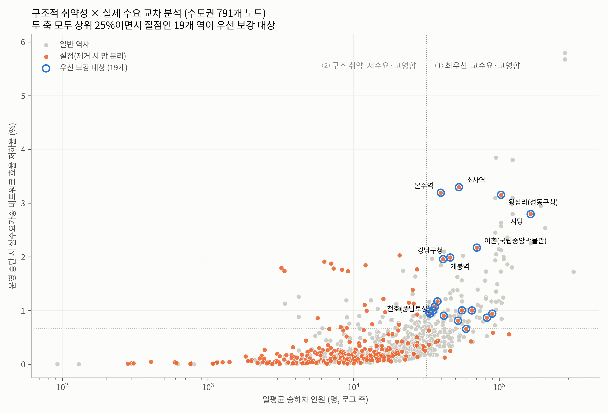
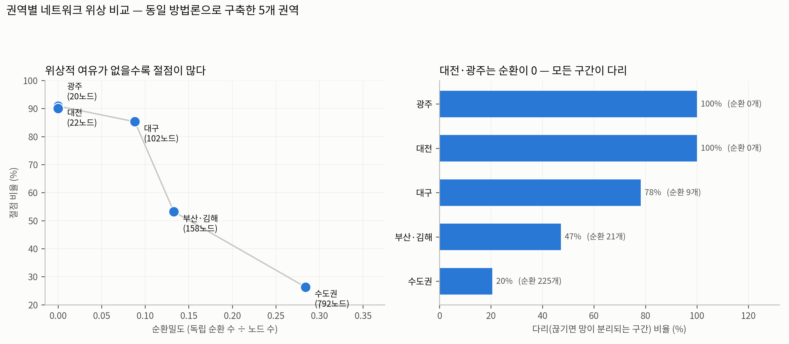

# 도시철도 네트워크 취약성 분석 (Raility)

국가철도공단 표준데이터로 **전국 도시철도망을 그래프·지식그래프로 구축**하고, 특정
역사·환승역의 운영 중단이 네트워크 구조와 승객 이동에 미치는 영향을 정량화하여
**핵심 역사와 취약 구간**을 도출한다.

- **투고 대상**: 한국ITS학회논문지(KITS)
- **분석 규모**: 노드 1,094(역×노선 쌍) · 엣지 1,266 / 지식그래프 노드 1,177 · 관계 5,688
- **주의**: 환승역은 노선별로 분리된 노드다. 수도권 노드 791개의 **물리적 역은 702개**
- **데이터 기준일**: 역사·노선 2026-06-30, 운행 2026-02-28

---

## 핵심 결과

### 1. 위상적 여유(순환)의 유무가 취약성을 결정한다 — 권역 간 단조 관계

같은 방법론으로 5개 권역을 구축·비교한 결과, **순환밀도**(독립 순환 수 ÷ 노드 수)가
낮을수록 절점·다리 비율이 체계적으로 높아진다. 대전·광주는 **순환이 0**, 즉 위상적으로
완전한 경로 그래프여서 **모든 구간이 다리**다. 우회 경로가 아예 존재하지 않는다.

| 권역 | 노드(역×노선) | 물리적 역 | 순환수 | 순환밀도 | 절점 비율 | 다리 비율 |
|---|---|---|---|---|---|---|
| 수도권 | 791 | 702 | 159 | 0.201 | 33.4% | 29.0% |
| 부산·김해 | 158 | 150 | 13 | 0.082 | 53.2% | 49.4% |
| 대구 | 102 | 99 | 6 | 0.059 | 85.3% | 80.4% |
| 대전 | 22 | 22 | 0 | 0.000 | 90.9% | **100%** |
| 광주 | 20 | 20 | 0 | 0.000 | 90.0% | **100%** |

수도권조차 노드 791개에 독립 순환이 159개뿐으로 트리(790엣지)에 근접한다. 따라서
절점·다리가 많다는 사실 자체는 발견이 아니라 **희소한 위상의 구조적 귀결**이며, 의미 있는
비교 대상은 그 절대 수가 아니라 **권역 간 순환밀도 격차**다.

### 2. 표적 공격에 대한 취약성 (기존 결과의 국내 재현)

역사의 10%를 선택적으로 제거하면 수도권 전역 효율이 **12.6%** 수준으로 떨어진다.
무작위 고장(52.1%) 대비 약 4.1배다.

| 제거 전략 | 10% 제거 시 전역 효율 | 최대연결요소 |
|---|---|---|
| 무작위 고장 | 52.1% | 61.3% |
| 매개중심성 표적 | 39.0% | 54.9% |
| 연결중심성 표적 | 13.6% | 11.8% |
| **적응형 표적(재계산)** | **12.6%** | **5.9%** |

> 이 결과는 Albert et al.(2000) 이래 여러 도시철도망에서 반복 확인된 성질의 **국내
> 전국 규모 재현**이며, 그 자체로 새로운 발견이 아니다. 본 연구에서의 역할은 구축한
> 그래프가 알려진 성질을 재현하는지 확인하는 **검증 절차**다.

### 3. 중심성은 실제 제거 영향도를 잘 예측한다 (n=791)

각 역을 실제로 제거해 측정한 효율 저하율과 중심성의 스피어만 순위상관:

| 중심성 | vs 효율 저하 | vs 승객가중 효율 저하 |
|---|---|---|
| 매개중심성 | **ρ = 0.725** | ρ = 0.674 |
| 연결중심성 | ρ = 0.525 | ρ = 0.456 |
| 근접중심성 | ρ = 0.242 | ρ = 0.269 |
| 고유벡터중심성 | ρ = 0.136 | ρ = 0.162 |

모두 p < 0.001. 매개중심성은 실제 영향도의 강한 예측자이며, 근접·고유벡터 중심성은
예측력이 낮다. **상위 몇 개 목록만 비교하면 "중심성과 실제 영향도가 어긋난다"는 잘못된
결론에 이르기 쉬우므로**, 전 표본 순위상관으로 검증했다(`results/claim_validation.csv`).

### 4. 운행빈도 프록시는 실수요를 제대로 대리하지 못한다 (방법론적 발견)

OD 자료가 없을 때 흔히 쓰는 **운행빈도(공급 지표) 프록시**를 실제 승하차 인원과 비교했다.

| 비교 | 스피어만 ρ | 해석 |
|---|---|---|
| 노드 가중치: 운행빈도 vs 실수요 | **0.182** | 사실상 다른 것을 재고 있음 |
| 제거 영향도: 프록시가중 vs 실수요가중 | 0.612 | 순위가 상당히 뒤바뀜 |

운행빈도는 **수요가 아니라 공급**이다. 열차는 수요가 많은 곳뿐 아니라 용량이 건설된 곳에서
자주 다닌다. 따라서 실수요 자료 없이 운행빈도로 승객 영향을 추정하면 편향이 발생한다.
본 연구는 KRIC 철도통계 **19개 운영기관 역별 승하차 실적**(연 53억 명, 노드 매칭 96.3%)을
확보해 이 문제를 제거했다.

### 5. 우선 보강 대상: 구조적 취약성 ∩ 실제 수요

절점(제거 시 망이 분리되는 역)은 수도권에만 264개다. 그 자체로는 정책 우선순위를 줄 수 없다.
**수요와 교차**해야 실무적 의미가 생긴다. 실수요가중 영향도와 일평균 승하차가 **모두 상위
25%이면서 절점인 역은 19개**로 좁혀진다.

| 역사 | 노선 | 일평균 승하차 | 실수요가중 효율 저하 | 분리 규모 |
|---|---|---|---|---|
| 소사역 | 경인선 | 52,943 | 3.30% | 40역 |
| 온수역 | 경인선 | 39,736 | 3.19% | 3역 |
| 왕십리(성동구청) | 2호선 | 102,959 | 3.15% | 1역 |
| 사당 | 2호선 | 164,609 | 2.79% | 1역 |
| 이촌(국립중앙박물관) | 4호선 | 70,264 | 2.17% | 2역 |
| 강남구청 | 7호선 | 46,144 | 1.99% | 2역 |

**소사역**은 하루 5.3만 명이 이용하면서 중단 시 40개 역이 분리된다 — 수요와 구조적 취약성이
동시에 최상위인 유일한 사례로, 최우선 보강 대상이다.

사분면 분류: 최우선(고수요·고영향) 129개 · 구조취약(저수요·고영향) 69개 ·
고수요(우회가능) 69개 · 일반 524개.

### 6. 취약 구간과 핵심 역사

**실수요 가중** 영향도 상위 역사는 신도림(5.80%)·가산디지털단지(3.85%)·청량리(3.80%)·
소사(3.30%)·온수(3.19%)다. 반면 **운행빈도 프록시 가중**으로는 도봉산(5.01%)·망월사(4.81%)·
회룡(4.77%)이 상위로 뒤바뀐다. 4절의 ρ=0.612가 실제로 어떤 형태의 왜곡인지가 여기서 드러난다:
프록시는 **단절을 유발하는 외곽 절점**을 과대평가하고, 실수요는 **단절은 없으나 우회 시 손실
시간이 큰 중추 환승역**을 상위로 올린다. 신도림·가산디지털단지·청량리는 분리 규모가 0인데도
최상위인데, 대체 경로가 있어도 그 경로가 훨씬 길기 때문이다. 두 지표는 서로 다른 위험을
가리키므로 보강 정책도 갈라져야 한다 — 전자는 우회 노선 신설, 후자는 증차·연계 수단 확충이다.

구간 기준으로는 도봉산–망월사(4.76%)·망월사–회룡(4.62%)이 최상위이며, 경원선 북부의 단일
경로가 끊기면 의정부 이북이 분리된다. 통과 통행 병목은 철산–가산디지털단지(구간 매개중심성
0.217) 등 7호선 광명 구간에 집중된다.

### 7. 계층적 장애 시나리오

노선·운영기관·광역시도 단위 동시 중단을 시뮬레이션했다. 다만 제거 규모가 큰 대상은
효율 저하가 클 수밖에 없으므로, 비교에는 **역당 파급력**(효율 저하 ÷ 제거 역수)을 함께 본다.

| 단위 | 대상 | 제거 역수 | 권역 효율 저하 | 역당 파급력 |
|---|---|---|---|---|
| 노선 | 대구 3호선 | 30 (31.9%) | 70.8% | **2.36** |
| 노선 | 2호선 (수도권) | 43 (5.2%) | 22.6% | 0.53 |
| 운영기관 | 부산교통공사 | 114 (84.4%) | 93.7% | 0.82 |
| 운영기관 | 서울교통공사 | 276 (33.5%) | 85.2% | 0.31 |

### 권역별 네트워크 특성

| 권역 | 역수 | 엣지수 | 평균 차수 | 평균 최단거리 |
|---|---|---|---|---|
| 수도권 | 791 | 949 | 2.40 | 39.0 km |
| 부산·김해 | 158 | 170 | 2.15 | 19.8 km |
| 대구 | 102 | 107 | 2.10 | 15.6 km |
| 대전 | 22 | 21 | 1.91 | 7.1 km |
| 광주 | 20 | 19 | 1.90 | 6.7 km |

---

## 그림

| | |
|---|---|
|  |  |
| **그림 1.** 전국 도시철도 네트워크 그래프 | **그림 2.** 복원력 곡선 |
|  |  |
| **그림 3.** 핵심 역사 상위 15 | **그림 4.** 대전 사례 |


**그림 5.** 지식그래프 기반 계층적 장애 시나리오


**그림 6.** 취약 구간 — 구간 단절 영향도 및 통과 통행 병목


**그림 7.** 구조적 취약성 × 실제 수요 교차 — 우선 보강 대상 19개 역


**그림 8.** 권역별 위상 비교 — 순환밀도와 취약성의 관계

---

## 방법

### 그래프 구축
- **노드** = 역사. 전역 고유키 `노선번호|역번호`
- **운행 엣지** = 노선정보 `정거장구성`의 연속 역쌍 (+ 운행정보로 신설·지선 구간 보완)
- **환승 엣지** = 동일 역명 · 좌표근접(<1.2 km) · 다른 노선
- **가중치** = 실측 역간거리(54.2% 커버) → 미확보 구간은 좌표 기반 직선거리, 환승 200 m 환산

### 지식그래프
`Station`·`Line`·`Operator`·`Region`·`MetroArea` 5종 엔티티와 `CONNECTS_TO`·`TRANSFERS_TO`·
`ON_LINE`·`OPERATED_BY`·`LOCATED_IN`·`IN_METRO_AREA`·`LINE_OPERATED_BY` 7종 관계.
중심성·제거 영향도가 역 속성으로 병합되어 KG 자체가 진단 결과를 담는다.
스키마·질의 예시는 [`docs/ONTOLOGY.md`](docs/ONTOLOGY.md) 참조. RDF Turtle과 Neo4j Cypher로도
제공한다.

**지식그래프 보는 법** — 목적에 따라 셋 중 하나를 쓰면 된다.

| 방법 | 준비 | 쓸모 |
|---|---|---|
| **`kg_explorer.html`** | 없음. 파일을 브라우저로 열면 끝 | 역 클릭 → 그 역의 KG 관계·취약성 확인. 발표·시연용 |
| **Neo4j** | Neo4j Desktop 설치 후 `kg/kg_import.cypher` 실행 | Cypher 질의로 임의 패턴 탐색 |
| **Gephi** | Gephi 설치 후 `kg/knowledge_graph.graphml` 열기 | 레이아웃·군집 시각화 |

`kg_explorer.html`은 `python make_explorer.py`로 언제든 다시 만들 수 있다(데이터가 파일 안에
그대로 들어가므로 인터넷·서버 없이 동작).

### 분석
1. **중심성**: 연결·매개·근접·고유벡터 (거리 가중)
2. **단일 역사 제거 전수 스윕**: 791개 역을 하나씩 제거하며 전역 효율·최대연결요소 변화 실측
2-b. **구간(엣지) 제거 전수 스윕**: 949개 구간을 하나씩 끊어 취약 구간 도출 + 구간 매개중심성
3. **순차 제거 시뮬레이션**: 무작위(10회 평균) vs 연결중심성 / 매개중심성 / 적응형(매 단계 재계산) 표적
4. **계층적 장애 시나리오**: KG 타입 관계를 질의해 노선·운영기관·광역시도 단위 동시 중단
5. **승객 이동 영향**: KRIC 철도통계 **역별 승하차 실적(실수요)** 을 노드 가중치로 사용해
   중력모형형 가중 효율 `E_d = Σ d_i d_j / dist_ij` 산출 (노드 매칭 96.3%).
   비교군으로 운행빈도 프록시도 함께 계산해 프록시의 타당성을 검증했다
6. **우선순위 도출**: 절점 여부(구조) × 일평균 승하차(수요) 교차 분류

### 환승 비용 민감도

환승 1회를 200 m 상당으로 환산한 것은 임의 가정이므로, 50~1600 m(32배 범위)를 훑어
결론의 안정성을 검증했다.

| 환승 비용 | 매개중심성 순위상관 | 상위 20 자카드 | 우선대상 영향도 순위상관 |
|---|---|---|---|
| 50 m | 0.955 | 0.667 | 0.853 |
| 100 m | 0.966 | 0.667 | 0.939 |
| **200 m (기준)** | — | — | — |
| 400 m | 0.968 | 0.905 | 0.960 |
| 800 m | 0.947 | 0.667 | 0.939 |
| 1600 m | 0.896 | 0.333 | 0.898 |

**순위 구조는 안정적**이다(매개중심성 ρ ≥ 0.90, 우선대상 영향도 ρ ≥ 0.85).
다만 **상위 20개 '집합'은 민감**해서, 환승 비용을 1600 m로 극단화하면 기준 대비 1/3만
겹친다. 따라서 개별 역을 단정적으로 지목하기보다 **순위 구조와 사분면 분류**로 해석하는
것이 타당하며, 본문의 우선 보강 19개 역도 그러한 범위 해석으로 제시한다.

> **효율 정규화 규약**: 제거 분석의 전역 효율은 **원 네트워크 크기로 정규화**하여, 제거된
> 역은 도달 불가로 0을 기여하게 했다. 남은 노드로 재정규화하면 종단부 역을 제거할 때
> 평균 거리가 짧아져 효율이 '증가'하는 artifact가 발생한다.

> **수요 자료**: 기종점(OD) 행렬은 공개되지 않으나 **역별 승하차 실적**은 KRIC 철도통계로
> 공개된다. 본 연구는 후자를 사용했다. 따라서 '어디서 어디로' 가는지는 알 수 없고
> '어느 역이 얼마나 붐비는지'만 반영된다 — 이것이 수요 측면의 남은 한계다.

---

## 재현 방법

> 실행 전, 용량 문제로 제외된 운행정보 원본 1개를
> [`data/raw/README.md`](data/raw/README.md) 안내대로 내려받아 `data/raw/`에 넣는다.

```bash
pip install -r requirements.txt

python build_graph.py    # 원본 → 물리 그래프 (data/processed/)
python build_ridership.py # 역별 승하차 실수요 통합 (data/processed/)
python analyze.py        # 중심성·역/구간 제거 시뮬레이션 (results/)
python build_kg.py       # 지식그래프 구축 (kg/)
python kg_scenarios.py   # 계층적 장애 시나리오 (results/)
python demand_analysis.py # 실수요 기반 취약성·우선순위 (results/)
python validate_claims.py # 주장 검증(순위상관·위상지표) (results/)
python sensitivity.py    # 환승비용 민감도 (results/)
python visualize.py      # 그림 8종 (figures/)
python make_explorer.py  # 지식그래프 탐색기 HTML
```

### 가상환경 (권장)

**conda (Anaconda 사용 시)**

```bash
conda env create -f environment.yml
conda activate raility
python -m ipykernel install --user --name raility --display-name "Python 3 (raility)"
jupyter lab
```

**venv (표준 파이썬)**

```bash
python -m venv .venv
.venv\Scripts\activate        # Windows  (macOS/Linux: source .venv/bin/activate)
pip install -r requirements.txt
pip install jupyterlab ipykernel
python -m ipykernel install --user --name raility --display-name "Python 3 (raility)"
jupyter lab
```

### 주피터 노트북

스크립트 대신 셀 단위로 중간 결과를 보며 실행하려면 `notebooks/`를 쓴다.
노트북은 위 모듈의 함수를 그대로 호출하므로 코드가 두 벌로 갈라지지 않는다.

| 노트북 | 내용 |
|---|---|
| `01_데이터_그래프구축.ipynb` | 원본 훑어보기, 품질 이슈 확인, 그래프 구축 |
| `02_취약성분석.ipynb` | 중심성, 역·구간 전수 스윕, 복원력 곡선 |
| `03_지식그래프.ipynb` | KG 구축, KG 질의 예시, 계층적 장애 시나리오 |
| `04_시각화.ipynb` | 그림 6종 인라인 표시, 탐색기 생성 |

> 노트북은 저장소 루트 기준으로 동작한다(첫 셀이 `notebooks/`에서 열렸을 때 자동으로
> 상위로 이동). 한글 그림 폰트는 Windows `Malgun Gothic`, macOS `AppleGothic`을 자동 선택한다.

## 저장소 구조

```
├── build_graph.py            물리 그래프 구축 (원본 → nodes/edges/graphml)
├── analyze.py                중심성·제거 시뮬레이션·복원력 곡선
├── build_kg.py               지식그래프 구축 (CSV/GraphML/Turtle/Cypher)
├── kg_scenarios.py           KG 기반 계층적 장애 시나리오
├── visualize.py              그림 8종 생성
├── demand_analysis.py        실수요 기반 취약성·우선순위
├── build_ridership.py        역별 승하차 통합
├── sensitivity.py            환승비용 민감도
├── validate_claims.py        주장 검증(순위상관·위상지표)
├── make_explorer.py          지식그래프 탐색기 HTML 생성
├── make_notebooks.py         notebooks/ 생성
├── environment.yml           conda 가상환경 정의
├── notebooks/                주피터 노트북 4종
├── data/
│   ├── raw/                  표준데이터 + 역간거리 4종 + 승하차 19종
│   └── processed/            nodes.csv, edges_*.csv, network.graphml
├── kg/                       지식그래프 산출물
├── results/                  중심성·영향도·복원력·시나리오 CSV
├── figures/                  그림 8종 (300 dpi)
└── docs/
    ├── README_데이터.md       데이터 명세서 (출처·스키마·정제 결정·품질 이슈)
    └── ONTOLOGY.md           지식그래프 온톨로지·질의 예시
```

## 데이터 출처

국가철도공단 표준데이터 (공공데이터포털 / 레일포털), 공공누리 제1유형

| 데이터 | 식별자 |
|---|---|
| 전국도시철도역사정보표준데이터 | data.go.kr 15013205 |
| 전국도시철도노선정보표준데이터 | data.go.kr 15013203 |
| 전국도시철도운행정보표준데이터 | data.go.kr 15013206 |
| 역간거리 (코레일 / 서울교통공사 / 신분당선 / 대구) | data.go.kr 파일데이터 |

원본 데이터의 품질 이슈(역번호 비고유성, 파일 간 노선번호 불일치, 좌표 오류 3건, 주소
시도 누락 222건, 노선번호–노선명 불일치 4건 등)와 정제 결정은
[`docs/README_데이터.md`](docs/README_데이터.md)와 [`docs/ONTOLOGY.md`](docs/ONTOLOGY.md)에
근거와 함께 기록되어 있다.

## 한계

- 인천공항 자기부상철도(운행중단)는 고립 노드로 분석에서 제외
- 실측 역간거리 미확보 권역(부산·대전·광주 등)은 직선거리 대체 (실측/직선 비율 중앙값 1.03)
- 역별 승하차는 있으나 OD 행렬은 미공개 — 통행의 기·종점 분포는 반영되지 않음
- 승하차는 2025년 연간(코레일 광역은 2025-10 실적의 연 환산)
- 재현성: 연결요소를 정렬해 실행 순서를 고정했고, 무작위 제거는 `SEED=42` 10회 평균
- 계층 시나리오의 효율 저하율은 각 권역 네트워크 기준이므로 권역 간 절대 비교에는 주의
- 환승 비용 200 m 환산은 임의 가정 — 50~1600 m 민감도 분석으로 순위 구조의 안정성을 확인했으나 상위 집합은 민감
- 절점·다리 수는 위상 희소성의 귀결이므로 그 자체를 '발견'으로 해석하지 않는다
