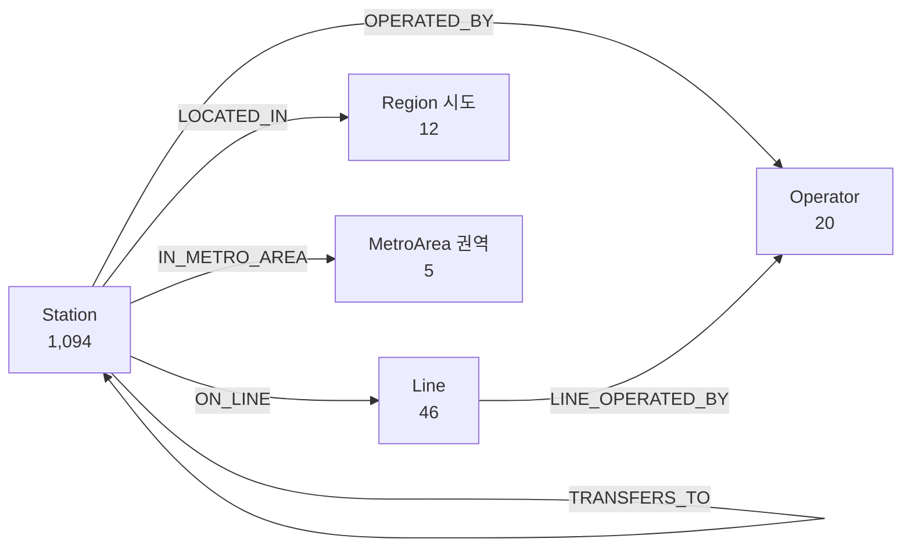

# 도시철도 지식그래프 온톨로지

물리 네트워크(역–역 단일 그래프)를 **타입이 있는 이종 그래프**로 재구성한 스키마다.
역이 어느 노선·기관·지역에 속하는지를 명시적 관계로 표현하므로, 단일 그래프로는
표현조차 불가능한 **상위 계층 단위의 동시 장애**를 질의·시뮬레이션할 수 있다.

네임스페이스: `https://github.com/leeseoyang/Raility/ns#`

## 스키마



## 엔티티 타입

| 타입 | 개수 | 설명 | 주요 속성 |
|---|---|---|---|
| `Station` | 1,094 | 역사. 식별자 `Station:<노선번호>\|<역번호>` | 역사명, lat, lon, 환승역, 주소, **매개중심성**, **효율저하율**, **단절유발** |
| `Line` | 46 | 노선. 식별자는 노선번호 | 노선명, altLabel, 역수, 노선연장_m, 개통일자 |
| `Operator` | 20 | 운영기관 | 역수 |
| `Region` | 12 | 광역시도 | 역수 |
| `MetroArea` | 5 | 권역(수도권·부산·김해권·대구권·대전권·광주권) | 역수 |

> `Station`에는 중심성·제거 영향도 등 **분석 결과가 속성으로 병합**되어 있다. 따라서 KG
> 자체가 "구조 + 취약성 진단"을 함께 담은 지식 자산으로 기능한다.

## 관계 타입

| 관계 | 개수 | 도메인 → 레인지 | 속성 |
|---|---|---|---|
| `CONNECTS_TO` | 1,089 | Station → Station | 거리_m, 소요시간_s, 평일운행횟수 |
| `TRANSFERS_TO` | 177 | Station → Station | — |
| `ON_LINE` | 1,094 | Station → Line | — |
| `OPERATED_BY` | 1,094 | Station → Operator | — |
| `LOCATED_IN` | 1,094 | Station → Region | — |
| `IN_METRO_AREA` | 1,094 | Station → MetroArea | — |
| `LINE_OPERATED_BY` | 46 | Line → Operator | — |

**총 1,177 노드 · 5,688 관계**

## 산출물

| 파일 | 용도 |
|---|---|
| `kg/kg_nodes.csv`, `kg/kg_edges.csv` | 표 형식 (pandas 등) |
| `kg/knowledge_graph.graphml` | NetworkX·Gephi |
| `kg/raility.ttl` | RDF Turtle (SPARQL) |
| `kg/kg_import.cypher` | Neo4j 임포트 |

## 질의 예시

**Cypher — 7호선을 통째로 세우면 몇 개 역이 멈추나**

```cypher
MATCH (s:Station)-[:ON_LINE]->(l:Line {label:'7호선'}) RETURN count(s);
```

**Cypher — 환승역이면서 단절을 유발하는 역 (기관별)**

```cypher
MATCH (s:Station)-[:OPERATED_BY]->(o:Operator)
WHERE s.단절유발 = 1 AND s.환승역 CONTAINS '환승'
RETURN o.label, count(s) AS 취약환승역수 ORDER BY 취약환승역수 DESC;
```

**SPARQL — 서울특별시 소재 역 중 승객가중 영향도 상위**

```sparql
PREFIX : <https://github.com/leeseoyang/Raility/ns#>
PREFIX rdfs: <http://www.w3.org/2000/01/rdf-schema#>
SELECT ?name ?impact WHERE {
  ?s a :Station ; rdfs:label ?name ;
     :LOCATED_IN ?r ; :승객가중효율저하율 ?impact .
  ?r rdfs:label "서울특별시" .
} ORDER BY DESC(?impact) LIMIT 10
```

## KG 구축이 드러낸 데이터 품질 이슈 (신규 2건)

엔티티를 타입별로 정규화하는 과정에서, 단일 그래프 구축 때는 보이지 않던 원본 오류가
추가로 드러났다. 두 건 모두 `build_kg.py`에서 보정하고 근거를 남겼다.

1. **도로명주소 222건이 시도로 시작하지 않음.** 대구교통공사 역 대부분이 구 단위
   ("수성구 …"), 구리도시공사 역이 동 단위("수택동 …")로 시작한다. 그대로 파싱하면
   `Region` 엔티티가 24개(구·동이 시도로 승격)로 오염된다. → 시도 약칭 매칭 → 기초자치
   단체 매핑 → 운영기관 기본 시도 순으로 3단계 해석해 **12개 시도로 정상화**(합계 1,094).
2. **동일 노선번호에 노선명이 2개인 사례 4건.** `I4101`=1호선/경부선, `I4401`=경부선/
   장항선, `S1107`=7호선/도시철도 7호선, `S1109`=서울 도시철도 9호선/수도권 도시철도
   9호선. → 노선번호를 정체성 기준으로 삼고 최빈명을 대표명, 나머지를 `altLabel`로 보존.

기존에 파악된 원본 품질 이슈(역번호 비고유성, 파일 간 노선번호 불일치, 좌표 오류 3건 등)는
[`README_데이터.md`](README_데이터.md) 참조.
